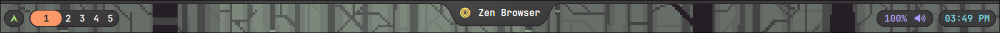

# PolarShell

A minimalist shell that tells you some system information.

> [!WARNING]
> Please note this shell is currently on very early development, and lots of bugs and missing content are expected. I have big plans for this shell!

### Features
---
So far, you can expect the following:
- System information like CPU, RAM and Disk usage.
- A small fetch to flex.
- Workspace indicator.
- Volume control: master and per app.
- Output device selection for sound.
- Clock and world clock.
- Calendar.

But in the future, our plans are:
- Application launcher.
- Music widget.
- Other notch styles for the window's title.
- Theme switcher.
- Special widgets that can switch depending on what's going on, like timer, weather, sport events, and more.

### Known Issues
---
Trust me, this shell has some problems. You can check the Issues page to see what's going on (yeahh as if I were to configurate that stuff).

### More?
---
What else can I write in my README.md idk

Do you want me to change the style to make it sound more natural? Any changes, hit me up!

AI makes mistakes. Check every fact.

